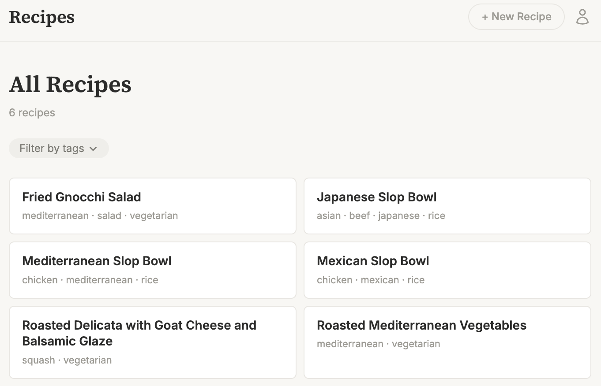
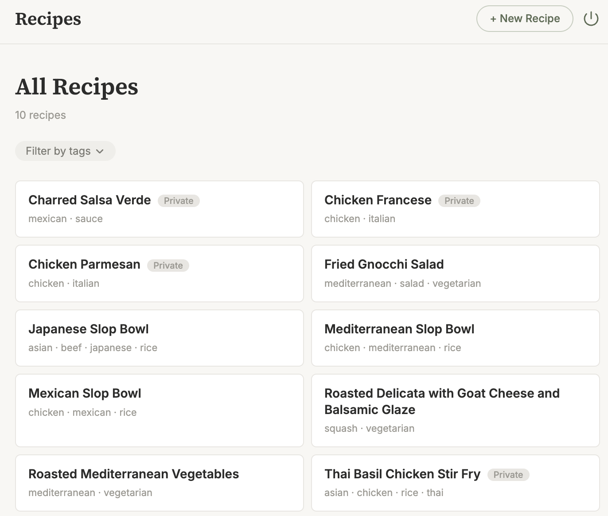
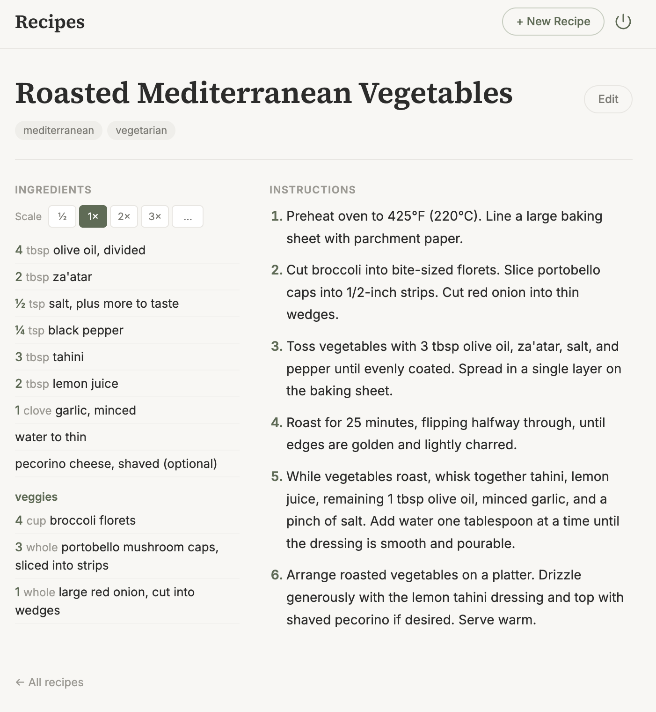
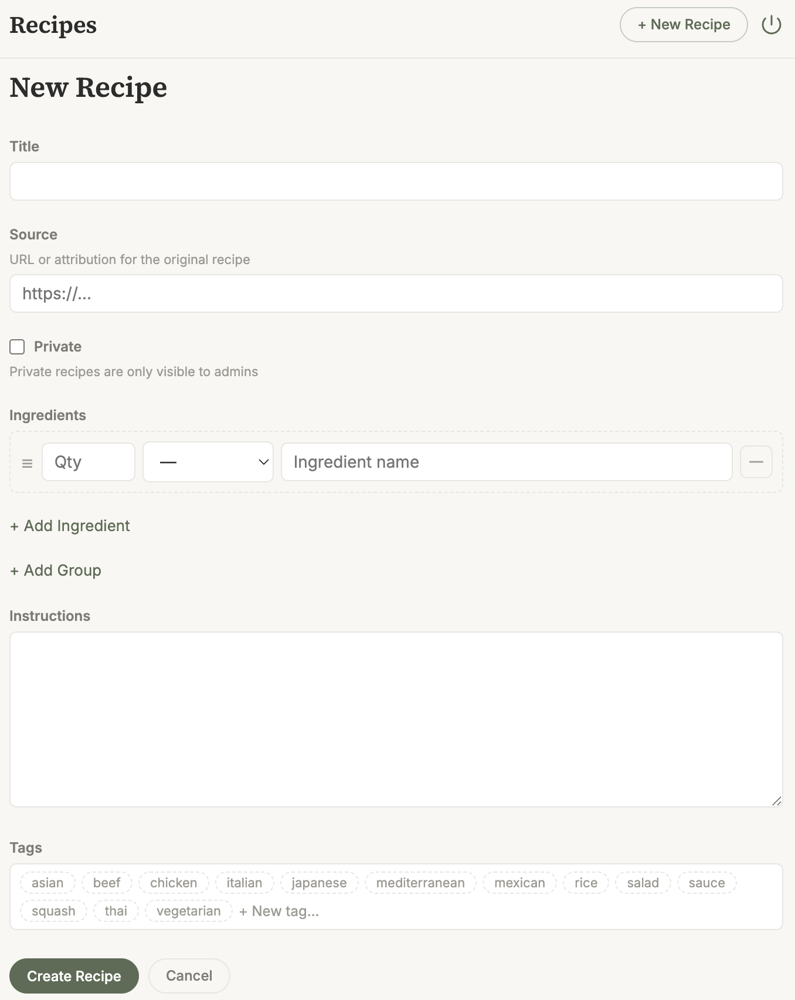

# Recipes

Personal recipe management app. Go backend, SQLite (via sqlc), HTMX, Tailwind CSS (CDN).

## Usage

```
go run . <subcommand> -h
```

| Subcommand | Description |
|---|---|
| `server` | Start the web server |
| `list-recipes` | List all recipes (id, slug, title) |
| `get-recipe` | Display a recipe as markdown |
| `put-recipe` | Create or update a recipe |

Creates `recipes.db` in the working directory on first run. Schema is applied automatically on startup.

## Authentication & Authorization

Optional OIDC authentication via [Pocket-ID](https://github.com/stonith404/pocket-id) (or any OIDC provider). Configure via environment variables or flags:

| Env Var / Flag | Description | Default |
|---|---|---|
| `OIDC_CLIENT_ID` / `--oidc-client-id` | OIDC client ID | _(none — auth disabled)_ |
| `OIDC_CLIENT_SECRET` / `--oidc-client-secret` | OIDC client secret | _(none — auth disabled)_ |
| `OIDC_ISSUER_URL` / `--oidc-issuer-url` | OIDC issuer URL | `https://idp.example.com` |
| `BASE_URL` / `--base-url` | App base URL (for redirect URI & cookie settings) | `http://localhost:8080` |

See `.env.example` for a template. If OIDC vars are not set, the app runs fully anonymous with no access controls.

When auth is enabled:
- Users in the `recipes_admin` group can create, edit, and delete recipes.
- Recipes can be marked **private** (visible only to admins).
- Non-admin users have read-only access to public recipes.
- CLI commands bypass auth and see everything.

## Screenshots

| Public recipe list | Admin recipe list |
|---|---|
|  |  |

| Recipe detail | Recipe editing |
|---|---|
|  |  |

## Development

- **SQL changes:** Edit `db/schema.sql` and `db/queries.sql`, then run `go run github.com/sqlc-dev/sqlc/cmd/sqlc generate`. Generated code lands in `db/generated/`.
- **Templates:** `templates/*.html` are embedded via `//go:embed`. Uses per-page template sets (layout + partials + page) for block inheritance. Templates use `missingkey=error`.
- **HTMX:** Delete uses `hx-delete` with `HX-Redirect` response header. Dynamic ingredient rows use `hx-get="/ingredients/row"` to append partials.
- **Routes:** Defined in `main.go`, handlers in `handlers.go`. Standard `net/http` mux with method-based routing (`GET /recipes/{slug}`, etc.).
